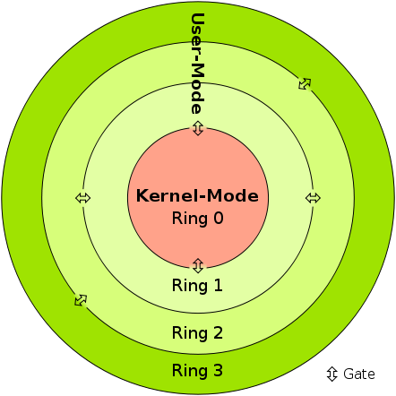

# ACTIVIDAD 1 

### 📌 SISTEMAS OPERATIVOS 1 Sección A

|  Nombre | Carnet  |
| ------------- | ------------- |
|Madeline Ariana Pérez Quiñónez| 201807117 |

## TIPOS DE KERNEL Y SUS DIFERENCIAS  📝

El kernel se encuentra en el centro del sistema operativo y controla todas las funciones importantes del hardware, ya sea un sistema Linux macOS o Windows, un smartphone, un servidor, una virtualización como KVM o cualquier otro tipo de ordenador.

Hay 3 tipos de kernel

Existen diferentes tipos de kernel para diferentes sistemas operativos y dispositivos finales. Conforme a sus características, pueden dividirse en tres grupos:

> ### Kernel monolítico. 

Un kernel grande para todas las tareas. Es el único responsable de la gestión de la memoria y de los procesos, de la comunicación entre procesos y proporciona funciones de soporte de drivers y hardware. Los sistemas operativos que usan el kernel monolítico son Linux, OS X y Windows.

> ### Microkernel. 

El microkernel se ha diseñado intencionadamente de un tamaño pequeño para que en caso de fallo no paralice todo el sistema operativo. No obstante, para que pueda asumir las mismas funciones que un kernel grande, está dividido en varios módulos. Como ejemplo de aplicación solo existe el componente Mach de OS X, ya que hasta ahora no hay ningún sistema operativo con microkernel.

> ### Kernel híbrido.

La combinación del kernel monolítico y el microkernel se denomina kernel híbrido. En este caso, el kernel grande se hace más compacto y modulable. Otras partes del kernel pueden cargarse dinámicamente. Esto ya ocurre en cierta medida en Linux y OS X.

## USER VS. KERNEL MODE ☯️

|  USER MODE | KERNEL MODE  |
| ------------- | ------------- |
|es un modo restringido, donde los programas de aplicación se ejecutan y se inicia.| es el modo privilegiado, en el que entra el ordenador cuando accede a los recursos de hardware. |
|se considera el modo esclavo o el modo restringido.|es el modo sistema, el modo maestro o el modo privilegiado.|
|un proceso obtiene su propio espacio de direcciones.|los procesos obtienen un único espacio de direcciones.|
|si se produce una interrupción, sólo falla un proceso.|si se produce una interrupción, todo el sistema operativo podría fallar.|
|hay restricciones para acceder a los programas del núcleo. No se puede acceder a ellos directamente.|se puede acceder tanto a los programas de usuario como a los del núcleo.|

